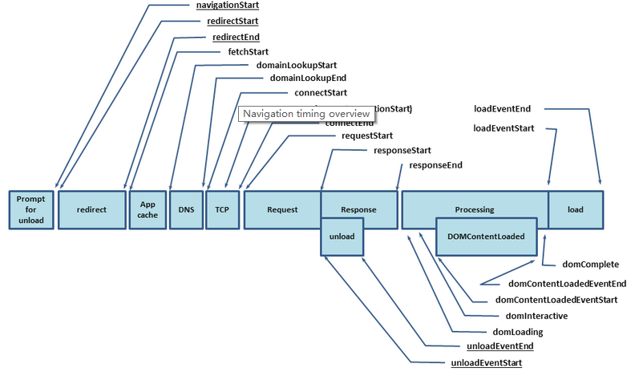

# 网页性能监控

- [概述](#概述)
- [PerformanceTiming接口](#performancetiming接口)
- [PerformanceNavigation接口](#performancenavigation接口)
- [widow.performance对象](#widow.performance对象)
- [利用window.performance进行网页性能监控](#利用window.performance进行网页性能监控)

## 概述

用户延迟是Web应用程序的重要质量基准。虽然基于脚本的机制， 可以为应用程序中的用户延迟测量提供全面的测试，但在许多情况下，它们无法提供完整的端到端延迟画面。
例如，以下脚本尝试衡量完全加载页面所需的时间：
```html
<HTML>
<HEAD>
<script type =“text/javascript”>

var start = new Date().getTime();
function onLoad(){
  var now = new Date().getTime();
  var latency = now  -  start;
  alert('页面加载时间' + latency);
}

</SCRIPT>
</HEAD>
<body onload ="onLoad()"">
<!- 主页正文从这里开始。 ->
</BODY>
</HTML>
```
该脚本计算在执行头部的第一位JavaScript 之后加载页面所需的时间，但不会提供有关从服务器获取页面所需的时间的任何信息。

为了满足用户体验的完整信息的需要，本文档介绍了PerformanceTiming 接口。此接口允许JavaScript机制在应用程序中提供完整的客户端延迟测量。利用所提出的接口，可以修改前面的示例来测量用户感知的页面加载时间。

以下脚本计算载入页面的时间：

```html
<HTML>
<HEAD>
<script type =“text/javascript”>
function onLoad(){
  var now = new Date().getTime();
  var page_load_time = now  -  performance.timing.navigationStart;
  alert("用户感知页面加载时间：" + page_load_time);
}

</SCRIPT>
</HEAD>
<body onload ="onLoad()"">
<!- 主页正文从这里开始->
</BODY>
</HTML>
```

## PerformanceTiming接口
```java
interface PerformanceTiming {
  readonly attribute unsigned long long navigationStart;
  readonly attribute unsigned long long unloadEventStart;
  readonly attribute unsigned long long unloadEventEnd;
  readonly attribute unsigned long long redirectStart;
  readonly attribute unsigned long long redirectEnd;
  readonly attribute unsigned long long fetchStart;
  readonly attribute unsigned long long domainLookupStart;
  readonly attribute unsigned long long domainLookupEnd;
  readonly attribute unsigned long long connectStart;
  readonly attribute unsigned long long connectEnd;
  readonly attribute unsigned long long secureConnectionStart;
  readonly attribute unsigned long long requestStart;
  readonly attribute unsigned long long responseStart;
  readonly attribute unsigned long long responseEnd;
  readonly attribute unsigned long long domLoading;
  readonly attribute unsigned long long domInteractive;
  readonly attribute unsigned long long domContentLoadedEventStart;
  readonly attribute unsigned long long domContentLoadedEventEnd;
  readonly attribute unsigned long long domComplete;
  readonly attribute unsigned long long loadEventStart;
  readonly attribute unsigned long long loadEventEnd;
};
```

### 各属性定义：
- navigationStart 属性

    该属性必须在用户代理完成提示卸载上一个文档之后立即返回时间。如果没有以前的文档，则此属性必须返回与 fetchStart 相同的值。

- unloadEventStart 属性

    如果以前的文档和当前文档同源，则该属性必须在用户代理启动前一个文档的卸载事件之前立即返回时间。如果没有以前的文档或者前一个文档的起始点与当前文档不同，则该属性必须返回零。

- unloadEventEnd 属性

    如果以前的文档和当前文档同源，则该属性必须在用户代理完成上一个文档的卸载事件之后立即返回时间。如果没有以前的文档或者前一个文档的起始点与当前文档不同，或者卸载尚未完成，则此属性必须返回零。

    如果 在导航时存在HTTP重定向等，并且并非所有重定向或等效物都来自相同的起始位置，那么unloadEventStart和unloadEventEnd都必须返回零。

- redirectStart 属性

    如果在导航时存在HTTP重定向等，并且如果所有重定向都来自相同的来源，则此属性必须返回启动重定向的提取的开始时间。否则，此属性必须返回零。

- redirectEnd 属性

    如果在导航时存在HTTP重定向等，并且所有重定向和等效物都来自相同的来源，则此属性必须在收到最后一个重定向的响应的最后一个字节之后立即返回时间。否则，此属性必须返回零。

- fetchStart 属性

    如果要使用HTTP GET等来获取新资源 ，则fetchStart必须在用户代理开始检查 任何相关应用程序高速缓存之前立即返回时间。否则，它必须返回用户代理开始 获取资源的时间。

- domainLookupStart 属性

    此属性必须返回用户代理启动当前文档的域名查找之前的时间。如果使用持久连接或从相关应用程序高速缓存或本地资源检索当前文档，则此属性必须返回与fetchStart相同的值。

- domainLookupEnd 属性

    此属性必须在用户代理完成当前文档的域名查找后立即返回时间。如果使用持久连接或从相关应用程序高速缓存或本地资源检索当前文档，则此属性必须返回与fetchStart相同的值。

> 本节不规范: 从HTTP缓存检查和检索内容是 提取过程的一部分。它由requestStart， responseStart和 responseEnd属性覆盖 。

> 例：在用户代理已经具有高速缓存中的域信息的情况下，domainLookupStart和domainLookupEnd表示用户代理启动并结束缓存中的域数据检索的时间。

- connectStart 属性

    该属性必须在用户代理开始建立与服务器的连接之前立即返回以检索文档的时间。如果使用持久连接或从相关应用缓存或本地资源检索当前文档，则此属性必须返回domainLookupEnd的值。

- connectEnd 属性

    该属性必须在用户代理完成与服务器建立连接以检索当前文档之后立即返回时间。如果使用持久连接或从相关应用缓存或本地资源检索当前文档，则此属性必须返回domainLookupEnd的值

    如果传输连接失败并且用户代理重新打开连接，则 connectStart和 connectEnd应返回新连接的对应值。

    connectEnd必须包括建立传输连接的时间间隔以及SSL握手和SOCKS认证等其他时间间隔。

- secureConnectionStart 属性

    此属性是可选的。没有此属性的用户代理可以将其设置为未定义。当此属性可用时，如果当前页面的方案是HTTPS，则此属性必须在用户代理启动握手过程之前立即返回保护当前连接的时间。如果此属性可用但未使用HTTPS，则此属性必须返回零。

- requestStart 属性

    此属性必须返回用户代理开始从服务器或 相关应用程序高速缓存或本地资源请求当前文档之前的时间 。

    如果在发送请求并且用户代理重新打开连接并重新发送请求之后传输连接失败，则requestStart应返回新请求的相应值。

该接口不包括表示发送请求的完成的属性，例如requestEnd。
> - 从用户代理发送请求的完成并不总是表示网络传输中的相应完成时间，这带来了具有这样的属性的大部分益处。
> - 一些用户代理具有高成本来确定由于HTTP层封装而发送请求的实际完成时间。

- responseStart 属性

    该属性必须在用户代理从服务器或相关应用程序高速缓存或本地资源接收响应的第一个字节之后立即返回时间 。

responseEnd 属性

- 该属性必须在用户代理接收当前文档的最后一个字节之后或在传输连接关闭之前立即返回时间（以较先者为准）。这里的文档可以从服务器， 相关应用缓存或本地资源接收。

- domLoading 属性

    此属性必须返回用户代理设置当前文档准备状态（current document readiness）为 “加载（loading）”之前的时间 。

- domInteractive 属性

    该属性必须在用户代理将当前文档准备状态设置为 “交互式（interactive）”之前立即返回时间 。

- domContentLoadedEventStart 属性

    该属性必须在Document发送DOMContentLoaded事件之前立即返回。

- domContentLoadedEventEnd 属性

    此属性必须在文档的DOMContentLoaded事件完成后立即返回时间。

- domComplete 属性

- 该属性必须在用户代理将文档准备状态设为“完成（complete）”之前立即返回。

如果当前文档的准备状态多次更改为相同的状态，则 domLoading， domInteractive， domContentLoadedEventStart， domContentLoadedEventEnd和 domComplete必须返回首次发生相应 文档准备状态更改的时间。

- loadEventStart 属性

    此属性必须返回当前文档的加载onload事件触发之前的时间。当加载事件尚未触发时，它必须返回零。

- loadEventEnd 属性

    此属性必须返回当前文档的加载事件完成的时间。当加载事件未触发或未完成时，它必须返回零。

## PerformanceNavigation接口

```java
interface PerformanceNavigation {
  const unsigned short TYPE_NAVIGATE = 0;
  const unsigned short TYPE_RELOAD = 1;
  const unsigned short TYPE_BACK_FORWARD = 2;
  const unsigned short TYPE_RESERVED = 255;
  readonly attribute unsigned short type;
  readonly attribute unsigned short redirectCount;
};
```
**各属性定义：**

1. type 属性

    此属性必须返回当前浏览上下文中最后一个非重定向导航的类型。它必须具有以下导航类型值之一:

    - TYPE_NAVIGATE：导航通过点击链接或输入用户代理地址栏中的URL或表单提交开始，或者通过除了TYPE_RELOAD 和TYPE_BACK_FORWARD之外的脚本操作进行初始化，如下所示。

    - TYPE_RELOAD：通过重载操作或location.reload（） 方法导航 。

    - TYPE_BACK_FORWARD：通过历史遍历操作导航。

    - TYPE_RESERVED：任何导航类型未由上述值定义。

> 客户端重定向（例如使用Refresh pragma pragma directive）不被视为HTTP重定向。在这种情况下，则type属性应该返回适当的值。如果导航到新的URL，返回TYPE_RELOAD。如果重新加载当前页面，则返回TYPE_NAVIGATE。

2. redirectCount 属性

    此属性必须返回自当前浏览上下文之前的上次非重定向导航以来的重定向次数。如果没有重定向或者与目标文档不在同一个起始点，那么该属性必须返回零。

## widow.performance对象

html5定义在window的新属性

```java
interface Performance {
  readonly attribute PerformanceTiming timing;
  readonly attribute PerformanceNavigation navigation;
};

partial interface Window {
  [Replaceable] readonly attribute Performance performance;
};
```
该window.performance提供性能方面的属性。

- timing 属性

    该timing属性表示自上次非重定向导航以来与浏览上下文相关的定时信息。此属性由PerformanceTiming接口定义。

- navigation 属性

    该navigation属性由定义PerformanceNavigation接口。

即
```
window.performance = {
    timing: {
        navigationStart:
        unloadEventStart:
        unloadEventEnd:
        redirectStart:
        redirectEnd:
        ...
    },
    navigation: {
        type:
        redirectCount:
    }
    ...
}
```
## 过程

下图分别说明了由PerformanceTiming接口定义的时序属性 以及PerformanceNavigation有或没有重定向的 接口。下划线的属性在涉及不同来源的文档的导航中可能不可用 。用户代理可以在定时之间执行内部处理，这允许定时之间的非规范间隔。



### 计算过程
1. 如果由于 以下任何原因导航导致中止，则中止这些步骤，而不更改window.performance.timing和window.performance.navigation中的属性。
    - 导航是由于中止 沙盒导航浏览上下文标志或 沙盒顶层导航浏览上下文标志，或预先存在一个尝试导航浏览上下文。
    - 导航是由页面内的片段标识符引起的。
    - 新资源将由某种内联内容处理。
    - 新资源将使用不影响浏览环境的机制来处理。
    - 用户拒绝允许文档被卸载。
2. 在用户代理提示卸载上一个文档之后，将当前时间记录为navigationStart。
3. 如果没有设置，请在window.performance.navigation.type中记录当前的导航类型：
    - 如果通过点击链接启动导航，或者在用户代理的地址栏中输入URL，或提交表单，或者通过除location.reload（）方法之外的脚本操作进行初始化，则导航类型为TYPE_NAVIGATE。
    - 如果通过元刷新或者location.reload（）方法或其他等效操作导致导航，请将导航类型设置为TYPE_RELOAD。
    - 如果由于历史记录遍历而启动导航，则导航类型为TYPE_BACK_FORWARD。
    - 否则，导航类型为TYPE_RESERVED。
4. 如果当前文档和以前的文档来自不同的来源，请将unloadEventStart和unloadEventEnd都设置为0，然后转到步骤 6。否则，将unloadEventStart记录为卸载事件之前的时间。
5. 卸载事件完成后，将当前时间记录为unloadEventEnd。
6. 如果要使用HTTP GET 等获取新资源，则 在用户代理检查相关应用程序高速缓存之前，将当前时间记录为 fetchStart。否则，在用户代理开始提取处理之前，将当前时间记录为fetchStart。
7. 让domainLookupStart，domainLookupEnd，connectStart和connectEnd是相同的值作为fetchStart。
8. 如果从相关应用程序缓存或本地资源（包括HTTP缓存）中获取资源 ，请转到步骤13。
9. 如果不需要域查找，请转到步骤11。否则，在用户代理启动域名查找之前，将时间记录为domainLookupStart。
10. 在域名查找成功完成后立即将时间记录为domainLookupEnd。在此之前，用户代理可能需要多次重试。如果域查找失败，则中止其余步骤。
11. 如果一个持久传输连接来获取资源，让connectStart和 connectEnd与domainLookupEnd的值相同。否则，在启动与服务器的连接之前立即将时间记录为connectStart，并在连接到服务器或代理建立后立即将时间记录为 connectEnd。此时，用户代理可能需要多次重试。如果无法建立连接，请中止其余步骤。
12. 在步骤11中，如果用户代理支持secureConnectionStart属性，则用户代理还应执行这些附加步骤 ：
    - 如果当前文档的方案是HTTPS，则用户代理必须 在握手过程之前立即将时间记录为secureConnectionStart，以确保连接。
    - 如果当前文档的方案不是HTTPS，则用户代理必须将secureConnectionStart的值设置为0。
13. 在用户代理开始发送文档请求之前，将当前时间记录为requestStart。
14. 在用户代理接收到响应的第一个字节后立即记录responseStart。
在收到响应的最后一个字节后立即记录responseEnd。
>如果用户代理无法发送请求或接收到整个响应，则返回步骤11，需要重新打开连接。

>例:当启用持久连接时，用户代理可能会首先尝试重新使用打开的连接来发送请求，同时可以异步关闭连接。在这种情况下，connectStart，connectEnd和requestStart应该表示通过重新打开的连接收集的定时信息。

16. 如果获取的资源导致HTTP重定向等，则
    - 如果当前文档和被重定向到的文档不是从同一个来源，请将redirectStart， redirectEnd， unloadEventStart， unloadEventEnd和 redirectCount设置为0.然后，使用新的资源返回到6。
    - 如果以前的重定向涉及到不是相同原点的文档，请将redirectStart， redirectEnd， unloadEventStart， unloadEventStart和 redirectCount设置为0.然后，使用新资源返回到步骤6。
    - 将redirectCount递增1。
    - 如果redirectStart的值为0，则将其设置为fetchStart的值。
    - 让redirectEnd成为responseEnd的值 。
    - 将window.performance.timing中的所有属性设置为0，除了 navigationStart， redirectStart， redirectEnd， unloadEventStart和 unloadEventEnd。
    - 用新的资源返回步骤6。
17. 在用户代理将当前文档准备状态设置为“加载” 之前，将时间记录为domLoading。
18. 在用户代理将当前文档准备状态设置为“交互式” 之前，将时间记录为domInteractive。
19. 在用户代理程序在文档触发DOMContentLoaded事件之前，将时间记录为domContentLoadedEventStart。
20. 在DOMContentLoaded事件完成后立即 记录domContentLoadedEventEnd的时间。
21. 在用户代理设置当前文档准备状态为 “完成” 之前，将时间记录为domComplete。
22. 在用户代理触发加载事件之前，将时间记录为loadEventStart。
23. 在用户代理完成加载事件后立即将时间记录为loadEventEnd。

## 利用window.performance进行网页性能监控
使用 Navigation Timing API 设置您的代码

结合使用 Navigation Timing API 和页面加载时发出的其他浏览器事件，您可以捕获并记录任何页面的真实 CRP 性能。

**指标具体时间点：**

- domLoading：这是整个过程的起始时间戳，浏览器即将开始解析第一批收到的 HTML 文档字节。
domInteractive：表示浏览器完成对所有 HTML 的解析并且 DOM 构建完成的时间点。
- domContentLoaded：表示 DOM 准备就绪并且没有样式表阻止 JavaScript 执行的时间点，这意味着现在我们可以构建渲染树了。
许多 JavaScript 框架都会等待此事件发生后，才开始执行它们自己的逻辑。因此，浏览器会捕获 EventStart 和 EventEnd 时间戳，让我们能够追踪执行所花费的时间。
- domComplete：顾名思义，所有处理完成，并且网页上的所有资源（图像等）都已下载完毕，也就是说，加载转环已停止旋转。
- loadEvent：作为每个网页加载的最后一步，浏览器会触发 onload 事件，以便触发额外的应用逻辑。
HTML 规范中规定了每个事件的具体条件：应在何时触发、应满足什么条件等等。对我们而言，我们将重点放在与关键渲染路径有关的几个关键里程碑上：

- domInteractive 表示 DOM 准备就绪的时间点。
- domContentLoaded 一般表示 DOM 和 CSSOM 均准备就绪的时间点。
如果没有阻塞解析器的 JavaScript，则 DOMContentLoaded 将在 domInteractive 后立即触发。
- domComplete 表示网页及其所有子资源都准备就绪的时间点。

根据不同的需求，可选择不同衡量指标。比如要分析页面开始解析到DOM准备就绪时间、到DOM CSSOM均准备就绪的时间 以及 到网页即所有子资源都就绪的时间，代码如下：

```html
<html>
  <head>
    <title>Critical Path: Measure</title>
    <meta name="viewport" content="width=device-width,initial-scale=1">
    <link href="style.css" rel="stylesheet">
    <script>
      function measureCRP() {
        var t = window.performance.timing,
          interactive = t.domInteractive - t.domLoading,
          dcl = t.domContentLoadedEventStart - t.domLoading,
          complete = t.domComplete - t.domLoading;
        var stats = document.createElement('p');
        stats.textContent = 'interactive: ' + interactive + 'ms, ' +
            'dcl: ' + dcl + 'ms, complete: ' + complete + 'ms';
        document.body.appendChild(stats);
      }
    </script>
  </head>
  <body onload="measureCRP()">
    <p>Hello <span>web performance</span> students!</p>
    <div></div>
  </body>
</html>
```